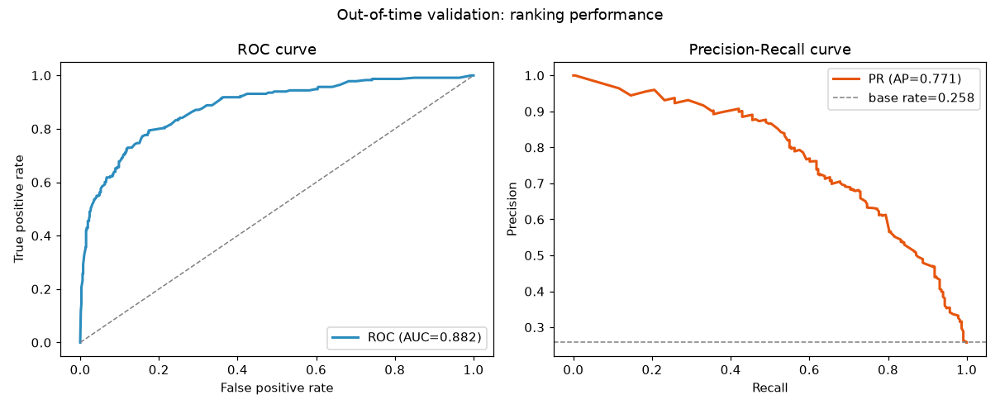
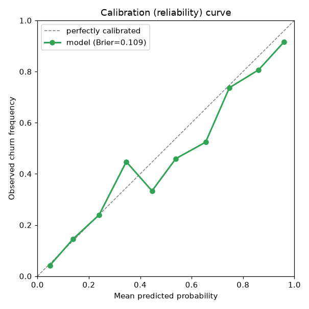
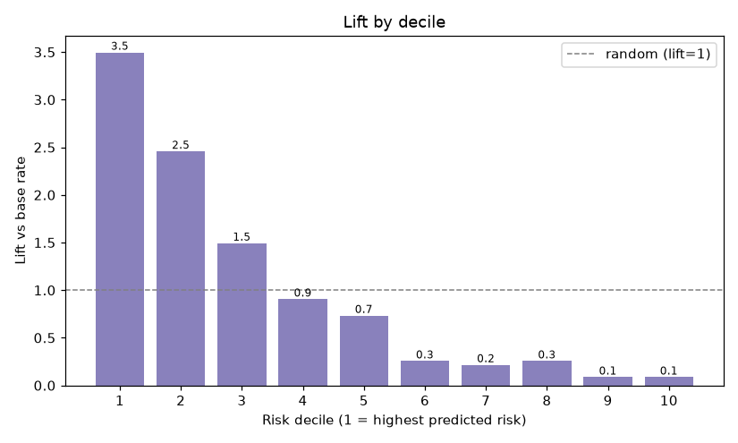
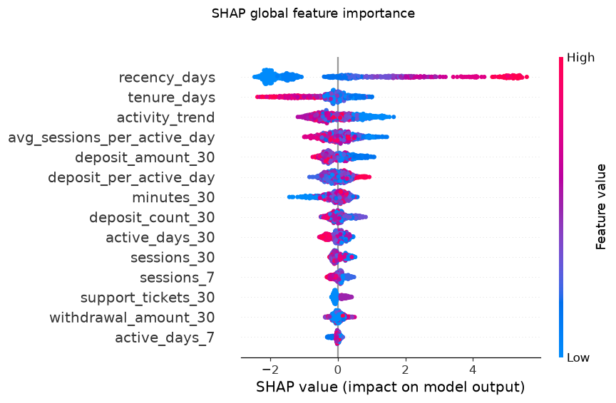

# Churn Prediction Pipeline (point-in-time, synthetic data)

[](https://github.com/ducal7/churn-prediction-pipeline/actions/workflows/ci.yml) [](LICENSE) [](https://www.python.org/)


A small but production-shaped pipeline that predicts **user churn** for a
gaming / fintech product, using **only synthetic data** generated by a seeded
script in this repo. It demonstrates the parts of a churn project that actually
decide whether the model is trustworthy in production:

- **Point-in-time feature engineering** with an explicit "as-of" cutoff, so no
  feature can ever see the future.
- **Out-of-time (temporal) validation** — the validation cutoff is strictly
  later in time than the training cutoff.
- A **calibrated** LightGBM classifier (isotonic), because a churn score is only
  useful if `P(churn)=0.3` really means 30%.
- **SHAP** global importance and per-user **reason codes**.
- Honest metrics: ROC-AUC, PR-AUC, calibration (Brier + reliability curve) and
  **lift by decile**.

> No external datasets, no employer/company data, no credentials — everything is
> generated locally and deterministically from a fixed seed.

---

## Why point-in-time / leakage matters

Churn datasets are a minefield of **target leakage**. The single most common way
to ship a "0.99 AUC" model that is worthless in production is to compute a
feature using information that, in real life, only becomes available *after* the
moment you would have to make the prediction.

This project leans into that on purpose. The synthetic `users` table ships with
deliberate **leakage traps** — columns aggregated over the *entire* horizon:

| Trap column | Why it leaks |
|---|---|
| `final_status` | the user's churned/active status at the *end* of the simulation |
| `churn_day` | the exact day the hidden process fired |
| `lifetime_deposit_total` | deposits summed over the whole horizon, including the future |
| `total_active_days`, `last_active_day` | activity counted past the cutoff |

The feature builder in [`src/churn/features.py`](src/churn/features.py) **never**
touches those columns. It only reads activity rows with `day <= cutoff`, and a
test (`test_features_ignore_the_future`) proves it: features built from the full
log are byte-for-byte identical to features built from a log truncated at the
cutoff. If any future row leaked into a feature, that test would fail.

The label, by contrast, is *defined* by the future window `(cutoff, cutoff+30]`
— that is legitimate for the target, and only the target.

---

## How it works

```
data/activity_log.parquet   ── daily-grain event log (the ONLY legit input)
data/users.parquet          ── per-user table incl. leakage traps (never used as features)

         build_features(cutoff)            build_labels(cutoff, horizon=30)
  activity ──────────────────► X (as-of T)   activity ──────► y (churn in (T, T+H])
                                   │                               │
                                   └──────────── join ─────────────┘
                                                │
   train @ cutoff day 120  ─────────────────────┤  out-of-time validation @ day 150
                                                ▼
                         CalibratedClassifierCV(LightGBM, isotonic)
                                                │
                         ┌──────────────────────┼───────────────────────┐
                     ROC / PR / Brier      lift by decile        SHAP reason codes
```

The two cutoffs (train = day 120, validate = day 150, horizon = 30 days) give a
genuine temporal hold-out: we learn the relationship in one period and check it
on a strictly later, unseen period.

---

## Run it end-to-end

Requires Python 3.11+. (Local development here used a `.venv`; see
*Reproducibility & environment notes* below.)

```bash
python -m venv .venv && source .venv/bin/activate
pip install -e ".[dev]"

make data        # generate the seeded synthetic dataset  (python -m churn data)
make train       # fit + calibrate the model              (python -m churn train)
make evaluate    # out-of-time metrics + result plots      (python -m churn evaluate)
make test        # pytest
make lint        # ruff check + ruff format --check
make all         # data + train + evaluate + test + lint
```

Score arbitrary users with reason codes:

```bash
python -m churn score --cutoff 150 --top-k 3
```

```
Highest-risk users:
 user_id  churn_probability                                                       reason_codes
    2131           0.996      +recency_days=13.00; +activity_trend=0.00; +deposit_amount_30=16.70
     144           0.994      +recency_days=13.00; +activity_trend=0.00; +tenure_days=29.00
```

---

## Results

Out-of-time validation (cutoff **day 150**, horizon **30 days**, n = 904 in-scope
users, base churn rate **25.8%**):

| Metric | Value |
|---|---|
| ROC-AUC | **0.882** |
| PR-AUC (avg precision) | **0.771** |
| Brier score | **0.109** |
| Top-decile lift | **3.50×** |
| Top-3-decile churn capture | **74.7%** |

The top 30% of users by predicted risk contain ~75% of the churners — the
actionable retention shortlist.

### ROC & Precision-Recall


### Calibration (reliability) curve


### Lift by decile


### SHAP global feature importance


Recency dominates (users who have gone quiet are the obvious flight risk),
followed by tenure, the recent-vs-baseline `activity_trend` momentum signal and
monetary engagement (`deposit_amount_30`). All four are point-in-time safe.

*(These plots are committed and regenerated by `make evaluate`; the exact numbers
will reproduce given the fixed seed.)*

---

## Project layout

```
src/churn/
  config.py     paths, seed, the point-in-time time grid
  data.py       seeded synthetic generator + leakage traps   (python -m churn.data)
  features.py   point-in-time feature builder + label builder
  model.py      calibrated LightGBM (+ base model for SHAP)
  metrics.py    ROC-AUC, PR-AUC, Brier, lift, calibration tables
  explain.py    SHAP global importance + per-user reason codes
  plots.py      committed result PNGs
  cli.py        argparse CLI: data / train / evaluate / score
tests/          determinism, no-future-leakage, metrics, e2e smoke
reports/        committed result plots (metrics.json / scores.csv are git-ignored)
```

---

## Reproducibility & environment notes

- All randomness flows from a single seed (`config.SEED`); the data generator is
  deterministic (`test_same_seed_same_data`).
- Dependencies are pinned in [`pyproject.toml`](pyproject.toml). CI
  ([`.github/workflows/ci.yml`](.github/workflows/ci.yml)) runs `ruff check`,
  `ruff format --check` and `pytest` on Python 3.11 for every push and PR.
- The pinned versions were resolved and the pipeline executed locally on CPython
  **3.14**. On 3.14 the `shap` dependency `numba` has no wheel yet, so a tiny
  no-op `numba` shim is dropped into the local `.venv` to let `shap` import; the
  TreeExplainer path used here does not need real numba. **CI runs on Python
  3.11**, where `numba` installs normally and no shim exists. This affects only
  the local dev environment, never the committed code.

> **Production analog:** in a real deployment the synthetic Parquet tables stand
> in for a columnar analytics warehouse such as **BigQuery** or **ClickHouse**;
> the point-in-time feature SQL and the `(cutoff, horizon)` labelling logic would
> run there, with this package consuming the resulting feature/label tables.

## License

MIT © 2026 Aditya Singh Rathore
